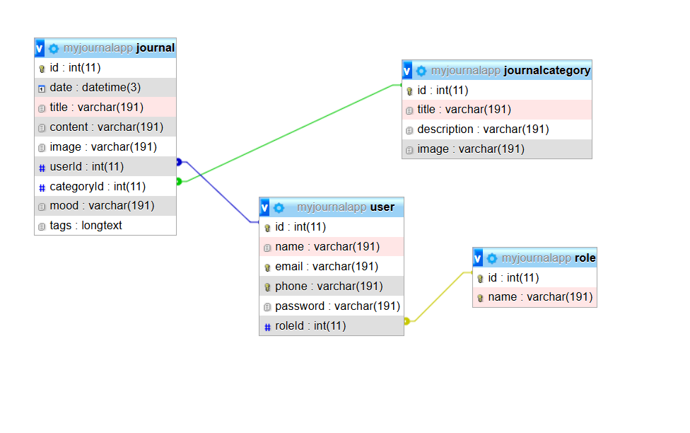

# Data Model Design

## Entities and Relationships


```mermaid
erDiagram
    USER ||--o{ JOURNAL : "1:N"
    USER {
        int id PK
        string name
        string email UK
        string phone UK
        string password
        int roleId FK
    }

    ROLE ||--o{ USER : "1:N"
    ROLE {
        int id PK
        string name UK
    }

    JOURNAL_CATEGORY ||--o{ JOURNAL : "1:N"
    JOURNAL_CATEGORY {
        int id PK
        string title
        string description
        string image
    }

    JOURNAL {
        int id PK
        datetime date
        string title
        string content
        string? image
        string? mood
        json? tags
        int userId FK
        int categoryId FK
    }
```

## Detailed Entity Relationships

1. **Role ↔ User (One-to-Many)**
    - Role can have multiple Users
    - Each User belongs to exactly one Role
    - **Foreign Key:** `roleId` in `User` table

2. **User ↔ Journal (One-to-Many)**
    - User can have multiple Journals
    - Each Journal belongs to exactly one User
    - **Foreign Key:** `userId` in `Journal` table

3. **JournalCategory ↔ Journal (One-to-Many)**
    - JournalCategory can have multiple Journals
    - Each Journal belongs to exactly one JournalCategory
    - **Foreign Key:** `categoryId` in `Journal` table

## Field Specifications

### Role Model
| Field | Type | Constraints | Description |
|---|---|---|---|
| id | Int | @id @autoincrement | Primary key |
| name | String | @unique | Role name (unique) |

### User Model
| Field | Type | Constraints | Description |
|---|---|---|---|
| id | Int | @id @autoincrement | Primary key |
| name | String |  | User's full name |
| email | String | @unique | Unique email address |
| phone | String | @unique | Unique phone number |
| password | String |  | Hashed password |
| roleId | Int |  | Foreign key to Role |

### JournalCategory Model
| Field | Type | Constraints | Description |
|---|---|---|---|
| id | Int | @id @autoincrement | Primary key |
| title | String |  | Category title |
| description | String |  | Category description |
| image | String |  | Category image URL/path |

### Journal Model
| Field | Type | Constraints | Description |
|---|---|---|---|
| id | Int | @id @autoincrement | Primary key |
| date | DateTime | @default(now()) | Entry creation date |
| title | String |  | Journal entry title |
| content | String |  | Journal entry content |
| image | String? |  | Optional associated image |
| mood | String? |  | Optional mood indicator |
| tags | Json? |  | Optional tags in JSON format |
| userId | Int |  | Foreign key to User |
| categoryId | Int |  | Foreign key to JournalCategory |
